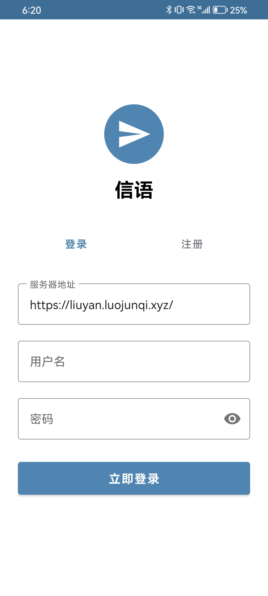
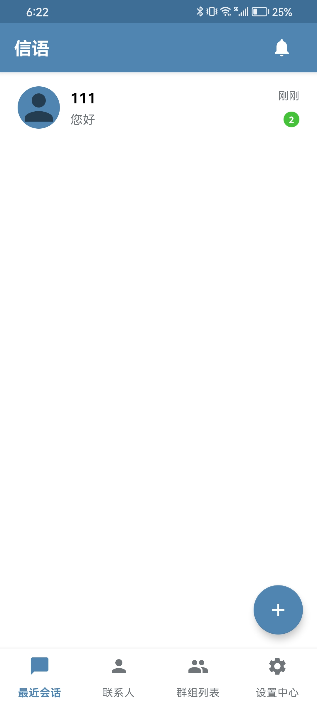
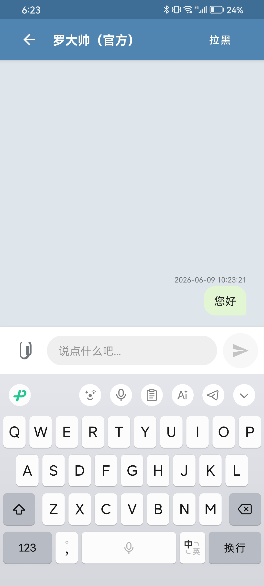
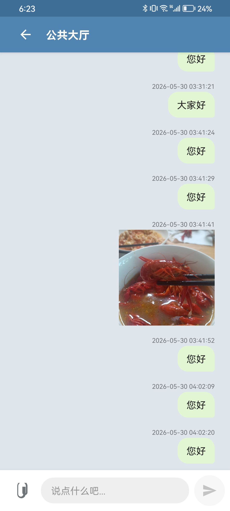

# XinYu 信语 - 开源安卓聊天应用

<div align="center">


**基于 Kotlin、Retrofit 和 WebSocket 构建的现代化极简开源安卓聊天客户端。**

[特性](#特性) • [屏幕截图](#屏幕截图) • [快速开始](#快速开始) • [API 接口参考](#api-接口参考) • [项目架构](#项目架构) • [开源协议](#开源协议)

</div>

---

## ✨ 特性

- **👥 多人群聊**：随时创建或加入多人在线群聊频道。
- **💬 保护私信**：与平台上的任何用户进行安全的一对一私密聊天。
- **⚡ 实时消息**：基于 WebSocket 连接实现低延迟、即时消息收发与输入状态（Typing）提示。
- **🛠️ 群组管理**：支持群主配置群聊名称、上传头像以及设置群成员黑白名单。
- **📁 图片与文件分享**：支持聊天中发送图片、PDF、Docx、Zip 等多种文件；支持图片大图预览和本地相册保存。
- **↩️ 消息撤回**：支持撤回自己发送的消息（限时2分钟内）。
- **⚙️ 个人设置**：登录后支持随时修改个人头像、自定义昵称、修改密码或注销账号。
- **🎨 精美交互 UI**：遵循 Material Design 规范，界面美观流畅，配合丰富的微动画。

---

## 📸 屏幕截图

| 登录界面 | 消息列表 | 私信窗口 | 群聊界面 |
| :---: | :---: | :---: | :---: |
|  |  |  |  |

*(注：截图仅供展示，实际布局会因本地版本迭代更新有所微调)*

---

## 🚀 快速开始

### 运行环境要求

- **Android Studio** Hedgehog (2024.1.1) 或更新版本
- **JDK** 17+
- **Android SDK** API 34 (compileSdk)
- **Gradle** 8.5+ (已包含内置 Gradle Wrapper)

### 克隆并编译

在终端中执行以下命令进行编译：

```bash
git clone https://github.com/luojunqi20111219/OpenBoard-A-modern-minimalist-lightweight-group-chat-and-messaging-platform.git
cd OpenBoard-A-modern-minimalist-lightweight-group-chat-and-messaging-platform/OpenBoardAndroid
./gradlew assembleDebug
```

或者直接导入 Android Studio：
1. 打开 Android Studio，选择 **File → Open**，然后选中 `OpenBoardAndroid` 目录。
2. 耐心等待 Gradle 同步（Sync）完成。
3. 连接手机或开启模拟器，点击运行按钮 ▶ **Run 'app'** 即可部署。

### 配置后端服务器

默认情况下，安卓客户端连接到云端演示服务器 `http://liuyan.luojunqi.xyz`。如果您部署了自己的信语服务器，请修改：

在 [RetrofitClient.kt](./app/src/main/java/com/openboard/nativeapp/data/api/RetrofitClient.kt) 中更新 `BASE_URL`：
```kotlin
private const val BASE_URL = "http://您的服务器IP或域名:端口/"
```

并确保配置 [WebSocketManager.kt](./app/src/main/java/com/openboard/nativeapp/data/api/WebSocketManager.kt) 中的连接地址同步更新。

---

## 🔌 API 接口参考

| 接口端点 | 请求方法 | 功能说明 |
| :--- | :--- | :--- |
| `/api/login` | POST | 用户登录 |
| `/api/register` | POST | 用户注册 |
| `/api/messages` | GET | 获取聊天记录 (Query 参数: `room_id`, `receiver`) |
| `/api/messages` | POST | 发送新消息 (支持文本与引用消息载荷) |
| `/api/messages/{id}` | DELETE | 撤回/删除单条发言 |
| `/api/upload` | POST | 单文件上传 (支持图片与常用文档，安全白名单校验) |
| `/api/users` | GET | 获取所有注册用户列表 |
| `/api/groups` | GET | 获取所有公开群聊列表 |
| `/api/groups` | POST | 创建新群组 |
| `/api/groups/{id}` | DELETE | 解散群组 (群主特权) |
| `/api/user/push_token` | POST | 上报设备唯一 ID 与 HMS 华为推送 Token |
| `/api/ws` | WS (WebSocket) | 用于实时消息广播、在线状态以及输入提示的长连接 |

### WebSocket 实时消息 JSON 示例

```json
{
  "type": "message",
  "user": "username",
  "content": "你好呀！",
  "room_id": 1,
  "receiver": "",
  "time": "2026-06-09 17:45:00"
}
```

---

## 📐 项目架构

客户端遵循高内聚低耦合的 **MVVM + 仓储 (Repository) 模式** 结构编写：

```text
app/
├── data/
│   ├── api/          # Retrofit 接口定义、OkHttp客户端配置及 WebSocket 管理器
│   ├── local/        # SharedPreferences SessionManager 本地会话管理
│   ├── model/        # 强类型数据传输模型 (User, Message, Group, WsMessage等)
│   └── repository/   # ChatRepository 数据仓储层，解耦业务逻辑与底层API
└── ui/
    ├── adapter/      # RecyclerView 适配器列表 (ChatAdapter, GroupAdapter等)
    ├── chat/         # ChatActivity 聊天面板控制器及逻辑实现
    ├── login/        # LoginActivity 登录/注册视图
    └── main/         # MainActivity 容器与主页 Fragment 分区 (消息列表、群组、个人中心)
```

**核心技术栈：**
- 使用 **Kotlin 协程 (Coroutines)** 和 **Flow** 处理非阻塞异步操作。
- 使用 **Retrofit 2 + OkHttp 4** 搭建高效率的 REST 和 WebSocket 实时通讯。
- 使用 **Glide** 完成流畅的图片多级缓存异步加载与圆形剪裁。
- 采用 **ViewBinding** 替换 findViewById，保障视图绑定安全性。
- 集成 **Huawei Mobile Services (HMS) Push SDK** 支持系统级后台唤醒推送与多设备下线。

---

## 🤝 参与贡献

我们非常欢迎开发者提交 Pull Request 或 Issue 来共同完善信语客户端！

1. Fork 本项目
2. 创建您的功能开发分支 (`git checkout -b feature/AmazingFeature`)
3. 提交您的修改 (`git commit -m 'Add some AmazingFeature'`)
4. 推送至该分支 (`git push origin feature/AmazingFeature`)
5. 新建并开启 Pull Request

---

## 📄 开源协议

本项目根据 **[MIT License](LICENSE)** 许可协议开源 - 详情请参阅 `LICENSE` 文件。

---

## 💖 致谢

- 感谢优秀的 [Retrofit](https://github.com/square/retrofit) 团队。
- 图标资源基于谷歌官方 [Material Design Icons](https://material.io/icons)。
- 图片加载依赖强大的 [Glide](https://github.com/bumptech/glide)。
