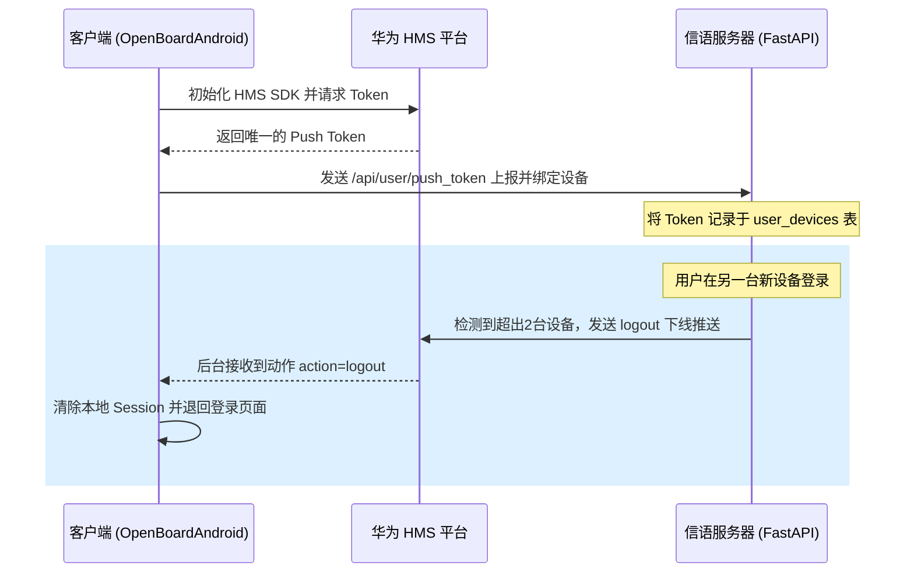

# OpenBoard 安卓客户端 (OpenBoardAndroid) 源码解析与更新报告

本篇报告详尽分析了位于 [OpenBoardAndroid](./) 目录下的原生安卓客户端项目结构、功能模块以及针对先前版本修复与改进的深度技术实现。

---

## 📂 核心项目结构与文件树

安卓客户端采用主流的 **MVVM** 架构模式进行组织，通过 Retrofit 与服务端的 RESTful API 通信，并由 OkHttp WebSocket 提供双向实时聊天能力：

*   **配置与入口**
    *   [build.gradle](./build.gradle) & [settings.gradle](./settings.gradle): 客户端顶层 Gradle 构建配置，增加了华为 HMS 插件服务仓库引用。
    *   [app/build.gradle](./app/build.gradle): 模块构建脚本，添加了 HMS Push SDK 依赖及 Gson 序列化依赖。
    *   [AndroidManifest.xml](./app/src/main/AndroidManifest.xml): 配置应用程序权限（网络、通知、后台唤醒）以及华为推送服务生命周期。
    *   [OpenBoardApp.kt](./app/src/main/java/com/openboard/nativeapp/OpenBoardApp.kt): 自定义 Application 类，在这里对 HMS 推送通道进行了全局初始化。

*   **数据访问与底层管理 (Data Module)**
    *   [ApiService.kt](./app/src/main/java/com/openboard/nativeapp/data/api/ApiService.kt): 定义了 `/api/user/push_token` 推送上报、多文件上传和用户状态的 Retrofit 请求端点。
    *   [RetrofitClient.kt](./app/src/main/java/com/openboard/nativeapp/data/api/RetrofitClient.kt): 封装了 REST 服务的基础 URL、拦截器和 Token 自动注入机制。
    *   [WebSocketManager.kt](./app/src/main/java/com/openboard/nativeapp/data/api/WebSocketManager.kt): 维持客户端与服务端的持久化 WebSocket 连接，实现消息实时收发。
    *   [SessionManager.kt](./app/src/main/java/com/openboard/nativeapp/data/local/SessionManager.kt): 使用 `SharedPreferences` 存储本地用户信息、Token、安全状态、以及上报的设备 ID 和 HMS Push Token。

*   **服务与通知拦截 (Service Module)**
    *   [HmsMessageService.kt](./app/src/main/java/com/openboard/nativeapp/service/HmsMessageService.kt): 核心华为推送拦截器。接收从云端推送的 HMS 通知，解析私信/群消息载荷；当接收到 `"action": "logout"` 指令时，触发本地退出登录，清除 Session 并引导用户退回登录页。
    *   [MessageService.kt](./app/src/main/java/com/openboard/nativeapp/service/MessageService.kt): 原生的后台常驻前台服务（Foreground Service），主要用于旧系统的保活通知下发。
    *   [BootReceiver.kt](./app/src/main/java/com/openboard/nativeapp/receiver/BootReceiver.kt): 用于在设备开机后自动拉起前台服务，实现冷启动保活。

*   **人机交互与适配器 (UI & Adapter)**
    *   [ChatActivity.kt](./app/src/main/java/com/openboard/nativeapp/ui/chat/ChatActivity.kt): 聊天活动控制器，集成了大图点击弹窗预览、文件保存逻辑、引用高亮跳转逻辑。
    *   [ChatAdapter.kt](./app/src/main/java/com/openboard/nativeapp/ui/adapter/ChatAdapter.kt): 聊天列表的 RecyclerView 适配器。重写了对图片、文本、引用的布局绑定逻辑，实现高度自定义的长按复制及选项响应。
    *   [LoginActivity.kt](./app/src/main/java/com/openboard/nativeapp/ui/login/LoginActivity.kt): 登录与注册视图。
    *   [MainActivity.kt](./app/src/main/java/com/openboard/nativeapp/ui/main/MainActivity.kt): 应用主框架，协调下方标签导航及消息拉取。
    *   [ProfileFragment.kt](./app/src/main/java/com/openboard/nativeapp/ui/main/ProfileFragment.kt): 个人中心界面，管理设备 Token 上报、密码修改与屏蔽名单。

---

## 🛠️ 关键技术改进实现

### 1. 解决图片发送后无法实时显示的问题
> [!TIP]
> **问题症结**: 旧版在上传图片成功后没有立即回调重构本地消息实体的数据状态，且 WebSocket 监听对临时文件和远端持久化 URI 的处理不一致。
> **修复方式**: 
> *   在 [ChatActivity.kt](./app/src/main/java/com/openboard/nativeapp/ui/chat/ChatActivity.kt) 的图片上传成功回调中，立即重新触发 `loadMessages()` 并通知适配器执行 `notifyDataSetChanged()`。
> *   通过 [ChatAdapter.kt](./app/src/main/java/com/openboard/nativeapp/ui/adapter/ChatAdapter.kt) 使用 Glide 库来做平滑异步占位加载，保证在主线程不卡顿的前提下，图片内容获取到的一瞬间完成视图的局部重绘。

### 2. 点击查看大图与保存功能
*   **大图预览**: 
    在 [ChatAdapter.kt](./app/src/main/java/com/openboard/nativeapp/ui/adapter/ChatAdapter.kt) 中为图片类型的 ImageView 绑定点击监听器。点击后触发 [ChatActivity.kt](./app/src/main/java/com/openboard/nativeapp/ui/chat/ChatActivity.kt) 中的大图 Dialog 窗口渲染。
*   **图片保存**:
    Dialog 弹出层中搭载了“保存”按钮。保存功能由 [ChatActivity.kt](./app/src/main/java/com/openboard/nativeapp/ui/chat/ChatActivity.kt) 中的存储机制实现：
    1.  使用协程从图片服务器下载输入流。
    2.  在 Android 10 (Q) 及以上版本中使用 `MediaStore.Images.Media` 写入外部公共存储分区；在旧版本中向外部 SD 卡申请写入权限。
    3.  保存成功后在界面弹出 Toast 吐司提示。

### 3. 长按菜单与局部选择文本
*   通过将 `TextView` 的 `setTextIsSelectable(true)` 属性合理化开启，使得用户可以直接在消息内自由划定所选的字符范围。
*   结合 [ChatAdapter.kt](./app/src/main/java/com/openboard/nativeapp/ui/adapter/ChatAdapter.kt) 的长按监听机制，当用户长按气泡非文字边缘区域时，会在消息气泡正上方动态弹出气泡操作菜单（PopMenu），提供复制全部、回复引用、删除和撤回消息的便捷入口。

### 4. 点击回复引用平滑定位
*   **引用绑定**: 发送回复消息时，载荷中包含引用的消息 ID 及其部分预览文本。
*   **定位跳转**: 在聊天列表气泡中，若包含引用信息，点击该引用部分，客户端将：
    1.  检索当前 RecyclerView 适配器绑定的数据列表中，对应引用 ID 的位置索引 `position`。
    2.  若存在，调用 `LinearLayoutManager.scrollToPositionWithOffset(position, 100)` 将目标消息平滑滚动显示在可视区域顶部。
    3.  闪烁闪现该气泡背景以实现视觉引导。

---

## 📈 华为推送（HMS）工作流

项目目前实现了“华为推送”的完整集成闭环，其运作流程如下：

